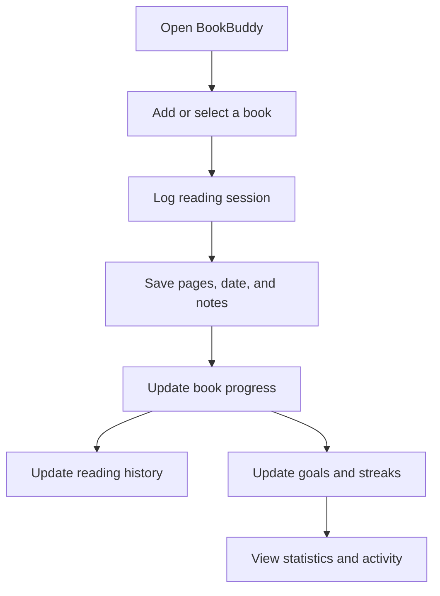

# 📚 BookBuddy — Offline-first Reading Tracker

<p align="left">
  <a href="https://bookbuddy-bg.netlify.app/">
    
  </a>
  <a href="https://github.com/s-badev/BookBuddy">
    
  </a>
</p>

<p align="left">
  
  
  
  
  
  
  
  
</p>

BookBuddy is a lightweight, offline-first reading tracker that helps users manage a personal book library, log reading progress, track goals, keep streaks, and stay consistent.

The project is built with **Vanilla JavaScript**, **Bootstrap**, **Vite**, and browser-based **localStorage** persistence — no backend required.

---

## ✨ Highlights

- 📚 Personal book library
- 📝 Reading logs with pages, date, and notes
- 🎯 Daily reading goals
- 🔥 Streak tracking
- 📊 Reading statistics and activity history
- 🎨 Theme preference saved locally
- ⚡ Offline-first localStorage persistence
- 🧩 Modular JavaScript structure
- 🚀 Deployed on Netlify

---

## 🧭 Application Flow



---

## 🌐 Live Demo

**[https://bookbuddy-bg.netlify.app/](https://bookbuddy-bg.netlify.app/)**

> Note: The Live Demo may be temporarily paused due to Netlify free-tier usage limits.  
> The full source code, screenshots, and functionality can still be reviewed in this repository.

If the demo is paused, the project can still be reviewed through:

- the source code
- the architecture documentation in this repository

---

## ✅ Quick Smoke Test

1. Open the live demo: [https://bookbuddy-bg.netlify.app/](https://bookbuddy-bg.netlify.app/)
2. Add a new book or use an existing one if seeded.
3. Open a book and click **"Логвай четене"**.
4. Enter pages, date, and optional note, then save.
5. Verify that:
   - the book stats update
   - logs appear in history
   - streak / goal widgets update correctly

---

---

## ✨ Features

- 📚 **Book Library** — add, edit, and manage your personal reading list
- 📝 **Reading Logs** — log pages, date, and notes for each reading session
- 🎯 **Goals & Streaks** — set a daily goal and track your consistency
- 🧩 **Challenges** — optional daily/weekly challenges to keep motivation high
- 🎨 **Theme Preference** — light/dark (or custom theme) stored locally
- ⚡ **Offline-first** — all data stored in `localStorage`, no backend needed

---

## ✅ Quick Smoke Test (≈ 60 seconds)

1. Open the live demo: https://bookbuddy-bg.netlify.app/
2. Add a new book (or use an existing one if seeded).
3. Open a book and click **"Логвай четене"**.
4. Enter pages + date (optional note) and save.
5. Verify:
   - the book stats update
   - logs appear in history
   - streak/goal widgets update correctly

---

## 🧱 Tech Stack

- **Frontend:** Vanilla JavaScript (ES Modules), Bootstrap
- **Build tool:** Vite (fast dev server + production build)
- **Persistence:** Browser `localStorage` (offline-first)

---

## 🧠 Architecture

### High-level modules

- **Pages/UI**
  - `index.html` — main app / dashboard
  - `form.html` — add/edit book forms
- **Repositories (data layer)**
  - `bookRepo.js` — CRUD for books
  - `logRepo.js` — reading logs (with dedup guard)
  - `challengeRepo.js` — challenges
  - `theme.js` — theme preference
- **Core logic**
  - `main.js` — UI rendering & orchestration

### Architecture diagram

```text
┌──────────────────────────────────────────────────────────┐
│                       UI / PAGES                          │
│  index.html, form.html                                     │
│  └─ main.js: renders UI, binds events                       │
└───────────────┬───────────────────────────────────────────┘
                │
                ▼
┌──────────────────────────────────────────────────────────┐
│                      REPOSITORIES                          │
│  bookRepo.js     → bookbuddy_books                          │
│  logRepo.js      → bookbuddy_logs                           │
│  settings.js     → bookbuddy_settings                       │
│  challengeRepo.js→ bookbuddy_challenges                     │
│  theme.js        → bookbuddy_theme                          │
└───────────────┬───────────────────────────────────────────┘
                │
                ▼
┌──────────────────────────────────────────────────────────┐
│                    DATA PERSISTENCE                        │
│  localStorage                                              │
│  • Books                                                    │
│  • Reading Logs                                             │
│  • Goal / Streak Settings                                   │
│  • Challenges                                               │
│  • Theme Preference                                         │
└──────────────────────────────────────────────────────────┘
```

---

## 🔁 Data Flow (Example: Log Reading)

```text
User clicks "Логвай четене"
        |
        ▼
Open Log Modal (main.js)
        |
        ▼
Validate input (pages, date, note)
        |
        ▼
Save log via LogRepo
  ├─ Dedup guard
  └─ localStorage: bookbuddy_logs
        |
        ▼
Re-render UI (stats + history)
```

---

## 🗝️ localStorage Keys

| Key | Purpose |
|---|---|
| `bookbuddy_books` | Array of books (id, title, author, status, etc.) |
| `bookbuddy_logs` | Reading sessions (bookId, pages, date, note) |
| `bookbuddy_settings` | Goal/streak settings + UI preferences |
| `bookbuddy_challenges` | Challenge state and completion |
| `bookbuddy_theme` | Theme preference |

---

## 🗂️ Project Structure

```text
bookbuddy/
├─ index.html
├─ form.html
├─ src/
│  ├─ main.js
│  ├─ styles/
│  │  └─ app.css
│  ├─ repositories/
│  │  ├─ bookRepo.js
│  │  ├─ logRepo.js
│  │  └─ challengeRepo.js
│  ├─ utils/
│  │  └─ helpers.js
│  └─ theme.js
├─ docs/                 (screenshots for README)
└─ vite.config.js
```

> Exact filenames may vary slightly depending on your repo — keep this section aligned with your real structure.

---

## 🚀 Run Locally

### Prerequisites
- Node.js **18+** (recommended)

### Install & run
```bash
npm install
npm run dev
```

### Production build
```bash
npm run build
npm run preview
```

---

## 🧭 Roadmap (v2 ideas)

- ✅ Export/Import (JSON backup)
- ✅ Filter/sort library (status, author, last read)
- ✅ Reading goals per book + global goal
- ✅ Better insights (weekly charts, averages, peak reading times)
- ✅ Optional cloud sync (Supabase/Firebase) **without breaking offline-first**

---

## 🧩 Problems Solved (Why it’s solid)

- **Offline-first reliability** — works without backend
- **Clean separation** — UI vs repositories vs storage
- **Data safety** — dedup guard for logs
- **Maintainability** — modular structure (easy to extend)

---

## 📄 License
For educational/demo purposes.
